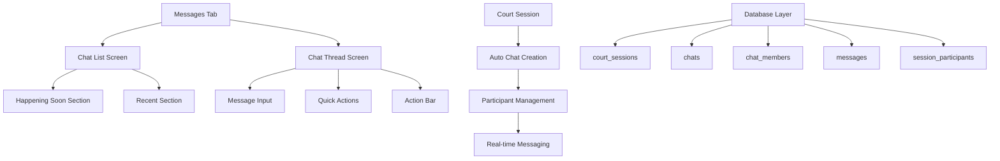

# Design Document

## Overview

The Messages experience transforms the current "Create Match" tab into a contextual messaging system that automatically creates group chats for court sessions. This design leverages the existing sports-matching app architecture while introducing real-time messaging capabilities that enhance user engagement and coordination around court sessions.

The system follows a session-centric approach where each court session becomes a communication hub, automatically managing participant access and providing rich contextual information about the game, location, and timing.

## Architecture

### High-Level Architecture



### Data Flow

1. **Session Creation**: When a court session is created, a corresponding chat is automatically generated
2. **Participant Management**: Users joining/leaving sessions trigger automatic chat membership updates
3. **Message Flow**: Real-time messages flow through Supabase realtime subscriptions
4. **UI Updates**: React Native components subscribe to data changes and update accordingly

### Integration with Existing System

The Messages experience integrates seamlessly with the existing match system:
- Leverages existing `matches` table as `court_sessions`
- Utilizes current `match_players` as `session_participants`
- Extends existing Supabase services architecture
- Maintains current navigation and theming patterns

## Components and Interfaces

### Screen Components

#### MessagesScreen (replaces CreateMatchScreen)
- **Purpose**: Main chat list interface with two-section layout
- **State Management**: Chat list, unread counts, loading states
- **Real-time Subscriptions**: New messages, membership changes
- **Navigation**: Handles tab replacement and chat thread navigation

#### ChatThreadScreen
- **Purpose**: Individual chat conversation interface
- **Features**: Message bubbles, typing indicators, quick actions
- **Real-time**: Live message updates, delivery states
- **Actions**: Sticky action bar with contextual options

### UI Components

#### ChatCard
```javascript
interface ChatCard {
  sessionId: string;
  courtIcon: string;
  sessionTitle: string;
  timeRange: string;
  participants: User[];
  lastMessage: Message;
  unreadCount: number;
  onPress: () => void;
}
```

#### MessageBubble
```javascript
interface MessageBubble {
  message: Message;
  isOwn: boolean;
  showAvatar: boolean;
  showTimestamp: boolean;
}
```

#### QuickActionBar
```javascript
interface QuickActionBar {
  actions: ['location', 'on-my-way', 'running-late', 'photo'];
  onActionPress: (action: string) => void;
}
```

### Service Layer Extensions

#### ChatService
```javascript
class ChatService {
  // Chat management
  getChatsByUser(userId: string): Promise<Chat[]>
  getChatMessages(chatId: string, limit?: number): Promise<Message[]>
  sendMessage(chatId: string, content: string, type?: string): Promise<Message>
  
  // Real-time subscriptions
  subscribeToChatMessages(chatId: string, callback: Function): Subscription
  subscribeToUserChats(userId: string, callback: Function): Subscription
  
  // Membership management
  addUserToChat(chatId: string, userId: string): Promise<void>
  removeUserFromChat(chatId: string, userId: string): Promise<void>
}
```

#### SessionService (extends MatchService)
```javascript
class SessionService extends MatchService {
  // Session-chat integration
  createSessionWithChat(sessionData: SessionData): Promise<Session>
  joinSessionAndChat(sessionId: string, userId: string): Promise<void>
  leaveSessionAndChat(sessionId: string, userId: string): Promise<void>
}
```

## Data Models

### Database Schema Extensions

#### chats
```sql
CREATE TABLE chats (
  id UUID PRIMARY KEY DEFAULT gen_random_uuid(),
  court_session_id UUID REFERENCES matches(id) ON DELETE CASCADE,
  created_at TIMESTAMP WITH TIME ZONE DEFAULT NOW(),
  updated_at TIMESTAMP WITH TIME ZONE DEFAULT NOW(),
  last_message_at TIMESTAMP WITH TIME ZONE,
  is_active BOOLEAN DEFAULT true
);
```

#### chat_members
```sql
CREATE TABLE chat_members (
  id UUID PRIMARY KEY DEFAULT gen_random_uuid(),
  chat_id UUID REFERENCES chats(id) ON DELETE CASCADE,
  user_id UUID REFERENCES profiles(id) ON DELETE CASCADE,
  joined_at TIMESTAMP WITH TIME ZONE DEFAULT NOW(),
  left_at TIMESTAMP WITH TIME ZONE,
  is_active BOOLEAN DEFAULT true,
  UNIQUE(chat_id, user_id)
);
```

#### messages
```sql
CREATE TABLE messages (
  id UUID PRIMARY KEY DEFAULT gen_random_uuid(),
  chat_id UUID REFERENCES chats(id) ON DELETE CASCADE,
  user_id UUID REFERENCES profiles(id) ON DELETE CASCADE,
  content TEXT NOT NULL,
  message_type VARCHAR(50) DEFAULT 'text',
  metadata JSONB,
  created_at TIMESTAMP WITH TIME ZONE DEFAULT NOW(),
  updated_at TIMESTAMP WITH TIME ZONE DEFAULT NOW(),
  is_deleted BOOLEAN DEFAULT false
);
```

### TypeScript Interfaces

#### Chat
```typescript
interface Chat {
  id: string;
  court_session_id: string;
  created_at: string;
  updated_at: string;
  last_message_at?: string;
  is_active: boolean;
  
  // Joined data
  session?: CourtSession;
  last_message?: Message;
  unread_count?: number;
  members?: ChatMember[];
}
```

#### Message
```typescript
interface Message {
  id: string;
  chat_id: string;
  user_id: string;
  content: string;
  message_type: 'text' | 'location' | 'status' | 'photo';
  metadata?: {
    location?: { lat: number; lng: number; address: string };
    status?: 'on-my-way' | 'running-late' | 'arrived';
    photo_url?: string;
  };
  created_at: string;
  updated_at: string;
  is_deleted: boolean;
  
  // Joined data
  user?: User;
  delivery_status?: 'sending' | 'sent' | 'failed';
}
```

#### CourtSession (extends existing Match)
```typescript
interface CourtSession extends Match {
  // Inherits all Match properties
  chat?: Chat;
  participants_count?: number;
  user_is_member?: boolean;
}
```

## Error Handling

### Network Resilience
- **Offline Message Queue**: Store messages locally when offline, sync when reconnected
- **Retry Logic**: Automatic retry for failed message sends with exponential backoff
- **Connection Status**: Visual indicators for connection state

### Data Consistency
- **Optimistic Updates**: Show messages immediately, rollback on failure
- **Conflict Resolution**: Handle concurrent message sends gracefully
- **State Synchronization**: Periodic sync to ensure data consistency

### User Experience
- **Loading States**: Skeleton screens for chat list and message loading
- **Error Messages**: Clear, actionable error messages for users
- **Fallback UI**: Graceful degradation when features are unavailable

## Testing Strategy

### Unit Testing
- **Service Layer**: Test all chat and session service methods
- **Components**: Test chat cards, message bubbles, and input components
- **Utilities**: Test message formatting, time calculations, and data transformations

### Integration Testing
- **Database Operations**: Test chat creation, membership management, and message flow
- **Real-time Features**: Test subscription handling and live updates
- **Navigation**: Test tab replacement and screen transitions

### End-to-End Testing
- **User Flows**: Test complete chat creation and messaging workflows
- **Session Integration**: Test automatic chat creation when joining sessions
- **Cross-platform**: Ensure consistent behavior across iOS and Android

### Performance Testing
- **Message Loading**: Test large chat history loading performance
- **Real-time Updates**: Test performance with multiple active chats
- **Memory Usage**: Monitor memory usage with long-running chat sessions

## Security and Privacy

### Row Level Security (RLS)
```sql
-- Chat access policy
CREATE POLICY "Users can only see chats they belong to" ON chats
  FOR SELECT USING (
    id IN (
      SELECT chat_id FROM chat_members 
      WHERE user_id = auth.uid() AND is_active = true
    )
  );

-- Message access policy  
CREATE POLICY "Users can only see messages from their chats" ON messages
  FOR SELECT USING (
    chat_id IN (
      SELECT chat_id FROM chat_members 
      WHERE user_id = auth.uid() AND is_active = true
    )
  );
```

### Data Protection
- **Message Encryption**: Consider end-to-end encryption for sensitive communications
- **Data Retention**: Implement message cleanup after session completion + 14 days
- **User Privacy**: Allow users to leave chats and restrict access to new messages

### Access Control
- **Session-based Access**: Chat access tied to session participation
- **Automatic Cleanup**: Remove inactive users from chats
- **Admin Controls**: Allow session hosts to manage chat membership

## Performance Optimization

### Database Optimization
- **Indexing**: Optimize queries with proper indexes on chat_members, messages
- **Pagination**: Implement cursor-based pagination for message history
- **Caching**: Cache frequently accessed chat metadata

### Real-time Optimization
- **Selective Subscriptions**: Only subscribe to active chats
- **Batch Updates**: Group multiple updates to reduce re-renders
- **Connection Management**: Efficiently manage WebSocket connections

### Mobile Optimization
- **Image Optimization**: Compress and resize photos before upload
- **Background Sync**: Sync messages when app becomes active
- **Battery Efficiency**: Optimize real-time subscriptions for battery life

## Accessibility

### Screen Reader Support
- **Semantic Labels**: Proper accessibility labels for all interactive elements
- **Message Announcements**: Announce new messages for screen reader users
- **Navigation**: Clear focus management and navigation patterns

### Visual Accessibility
- **Contrast Ratios**: Maintain 4.5:1 contrast ratio for all text
- **Font Scaling**: Support dynamic font sizing
- **Color Independence**: Don't rely solely on color for information

### Motor Accessibility
- **Touch Targets**: Minimum 44pt touch targets for all interactive elements
- **Gesture Alternatives**: Provide alternatives to complex gestures
- **Haptic Feedback**: Appropriate haptic feedback for actions

## Migration Strategy

### Phase 1: Infrastructure Setup
1. Create new database tables and policies
2. Extend existing services with chat functionality
3. Set up real-time subscriptions

### Phase 2: UI Implementation
1. Create Messages screen to replace Create Match tab
2. Implement chat list with two-section layout
3. Build chat thread interface with basic messaging

### Phase 3: Advanced Features
1. Add quick actions and contextual controls
2. Implement typing indicators and delivery states
3. Add photo sharing and location features

### Phase 4: Polish and Optimization
1. Add animations and micro-interactions
2. Optimize performance and battery usage
3. Comprehensive testing and bug fixes

### Rollback Plan
- Maintain Create Match functionality as fallback
- Feature flags to enable/disable Messages tab
- Database migration rollback scripts
- User preference to switch between old/new interface